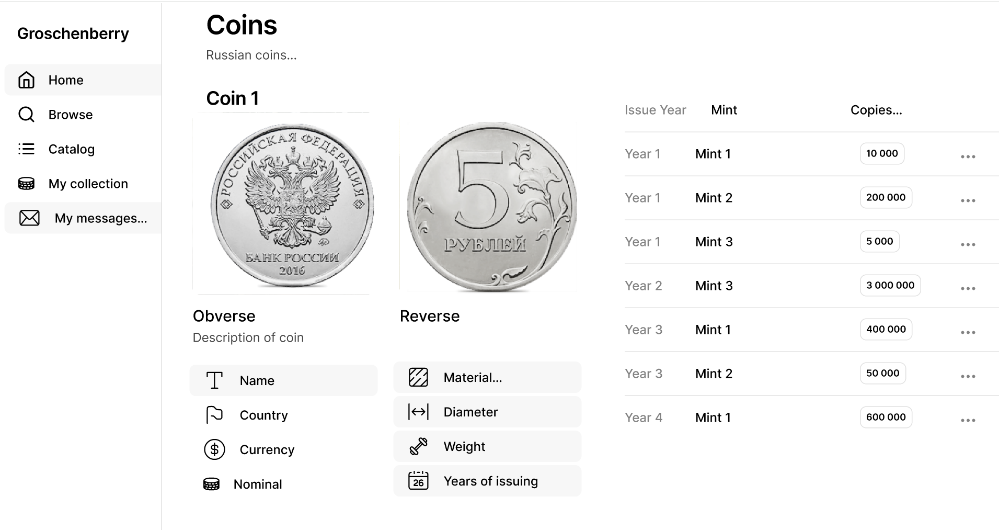

# groschenberry

Учебный проект Дитиной Марии
Курс [Kotlin Backend Developer](https://otus.ru/lessons/kotlin/).
Поток курса 2025-02.

Groschenberry -- это приложение для нумизматов, позволяющее вести учёт монет, осуществлять обмен/продажу монет. 
Предоставляет справочник монет Российской Федерации, позволяет добавлять монеты из справочника в свои коллекции (приватные и публичные), 
выставлять свои монеты для продажи/обмена, искать монеты по публичным коллекциям других пользователй.

## Визуальная схема фронтенда

## Документация

1. Маркетинг и аналитика
    1. [Целевая аудитория](./docs/01-biz/01-target-audience.md)
    2. [Заинтересанты](./docs/01-biz/02-stakeholders.md)
    3. [Пользовательские истории](./docs/01-biz/03-bizreq.md)
2. Аналитика:
    1. [Функциональные требования](./docs/02-analysis/01-functional-requiremens.md)
    2. [Нефункциональные требования](./docs/02-analysis/02-nonfunctional-requirements.md)
3. DevOps
   1. [Файлы сборки](./deploy)
4. Архитектура
   1. [ADR](./docs/04-architecture/01-adrs.md)
   2. [Описание API](./docs/04-architecture/02-api.md)
   3. [Компонентная схема](./docs/04-architecture/03-arch.md)
5. Тесты
   1. [Тестовые сценарии](./docs/05-testing/01-tests-list.md)

# Структура проекта
